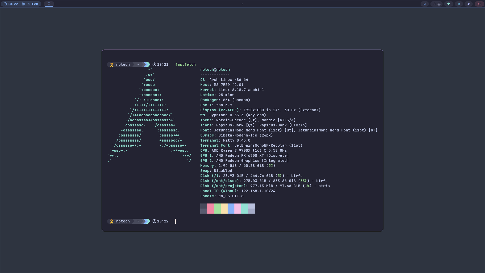

# ❄️ ArchDev v3.0 - The Elite Developer Infrastructure (Ansible Edition)



<div align="center">


**O ambiente definitivo para produtividade extrema em Arch Linux.**
*Agora reescrito do zero com Ansible para automação profissional, idempotência e modularidade pura.*

[Instalação](#-instalação) • [Pós-Instalação](#-pós-instalação) • [Ambientes Herméticos](#-ambientes-herméticos-bubble-v30) • [Atalhos do Sistema](#-domínio-do-sistema-guia-de-atalhos-master)

</div>

---

## 💎 A Filosofia ArchDev v3.0

O **ArchDev v3.0** não é apenas uma atualização visual. É uma evolução na arquitetura. Abandonámos os scripts bash frágeis e abraçámos a **Infraestrutura como Código (IaC)** com **Ansible**.

*   **Idempotente**: O `setup.sh` pode ser corrido infinitas vezes. Ele apenas aplica o que mudou, sem duplicar configs ou partir o sistema.
*   **Modular**: Queres apenas a stack PHP? O ambiente gráfico? É tudo gerido por `roles` independentes.
*   **Seguro**: Rollbacks automáticos no boot (Btrfs + Snapper + Limine) e backups automáticos das tuas configs locais antes de qualquer alteração.
*   **Estético**: Transição completa para **Catppuccin Mocha** (GTK, Qt, Hyprland, SDDM, Terminal), substituindo o antigo Nord.

---

## 🛠️ Stack Tecnológica

### Core
- **Window Manager**: Hyprland (Wayland puro)
- **Barra**: Waybar (Estilo "Pill" Catppuccin) com notificações de updates
- **Launcher**: Rofi (Substituto do Wofi da v2.0)
- **Terminal**: Kitty (GPU accelerated) + ZSH + Starship Prompt
- **Editor**: Neovim Pro (Lazy.nvim, LSP, Treesitter)
- **PDF**: Zathura (tema Catppuccin Mocha)
- **Boot**: Limine + Btrfs Assistant
- **Saúde**: Wlsunset (filtro de luz azul automático)

### Development Ready (Últimas Versões)
- **Laravel / PHP (ASDF Versionado)**:
    - **PHP 8.x via ASDF**: Versionamento de PHP por projeto usando `bubble l`.
    - Todas as extensões ativas (bcmath, intl, gd, pdo, etc.).
    - **MariaDB Otimizado**: Configuração "Muscle Car" para 64GB RAM + NVMe.
    - **Apache**: Configurado com `mpm_prefork` e suporte a vhosts.
    - **phpMyAdmin**: Pré-configurado via Apache e Socket Unix.
- **Python Ecosystem**: Poetry + Pyenv (via ASDF) para gestão hermética (`bubble p`).
- **Docker**: Configurado (rootless opcional) e `docker-compose`.
- **Password Manager**: `pass` + `rofi-pass` (Super+P) para gestão segura de passwords.

---

## 🚀 Instalação

### 1. Pré-requisitos (Arch Linux Limpo)
Recomendamos instalar o Arch Linux usando o **`archinstall`** com estas opções críticas para garantir a resiliência do sistema:

*   **Bootloader**: Escolha **Limine** (Moderno/Rápido e nativo para snapshots).
*   **Filesystem**: Escolha **Btrfs**.
*   **Profile**: Escolha **Minimal** (sem ambiente gráfico). O nosso script instala o Hyprland.
*   **Audio**: Escolha **Pipewire**.

### 2. Passo-a-passo no Novo Sistema

```bash
# 1. Clone o repositório
git clone https://github.com/teu-usuario/ArchDev3.0.git
cd ArchDev3.0

# 2. Execute o Setup Mágico
chmod +x setup.sh
./setup.sh
```

**O que o script faz sozinho:**
1.  Verifica e instala o Ansible.
2.  Instala todos os pacotes (Pacman + AUR).
3.  Configura o sistema (Btrfs, Snapper).
4.  Configura a UI (Hyprland, Waybar, Catppuccin).
5.  Sincroniza os Dotfiles e Scripts.

> 💡 **Nota:** Após a instalação podes apagar a pasta `ArchDev3.0/`. O sistema fica independente.

---

## 🔧 Pós-Instalação & Manutenção

> ⚠️ **IMPORTANTE:** Após correr `./setup.sh`, executa:
> ```bash
> sudo reboot
> ```
> O reboot é necessário para o Docker ativar e o Hyprland iniciar corretamente.

### 1. MariaDB (Segurança)
Após o reboot, configura o MariaDB automaticamente:
```bash
sudo archdev-mariadb-setup
```
Este script configura tudo automaticamente e gera uma password segura para root.

> 💡 Alternativa manual: `sudo mariadb-secure-installation`

### 2. Docker
O teu utilizador já está no grupo `docker`. Após o **reboot**, testa:
```bash
docker run hello-world
```

### 3. Spotify
O Spotify e o tema Catppuccin já estão instalados. Basta abrir o Spotify uma vez para ativar.

### 4. Password Manager (pass)
Configura o gestor de passwords (requer chave GPG):
```bash
archdev-pass-setup
```
Depois usa `Super+P` para abrir o rofi-pass.

### 5. Apagar a Pasta de Instalação (Opcional)
Após a instalação completa, a pasta `ArchDev3.0/` pode ser removida:
```bash
cd ..
rm -rf ArchDev3.0/
```
O sistema fica totalmente independente.

### 6. Limpeza do Sistema
Mantenha o sistema leve:
*   `paccache -r`: Mantém apenas as 3 últimas versões de pacotes.
*   `docker system prune -a`: Remove containers e imagens não usados.

---

## 🧬 Ambientes Herméticos (Bubble v3.0)

O setup v3.0 mantém o conceito de **bolhas de ambiente** da v2.5. Cada projeto é isolado.

### O Comando `bubble`
Dentro da pasta do seu projeto, execute:

```bash
bubble [opção]
```

| Comando | Descrição | O que faz por trás dos panos? |
| :--- | :--- | :--- |
| `bubble l` | Cria bolha **Laravel / PHP** | Cria `.tool-versions` (php) e ativa `direnv` com suporte asdf. |
| `bubble p` | Cria bolha **Python** | Cria `.tool-versions` (python/poetry) e configura virtualenv local. |

**Exemplo Laravel:**
```bash
mkdir meu-projeto && cd meu-projeto
git init
bubble l
# O terminal agora usa a versão PHP definida no projeto, isolada do sistema.
```

---

## 🔄 Automação Git (Sync Offline)

Se ativar esta opção, o serviço `git-autosync` corre em background:
*   Monitoriza a sua pasta de projetos (definida na instalação).
*   A cada 5 minutos, verifica se há internet.
*   Se houver, faz `git push` automático de todos os repositórios. Perfeito para trabalhar offline e sincronizar assim que apanhar Wi-Fi.

---

## ⌨️ Domínio do Sistema (Guia de Atalhos Master)

### 🖥️ Interface & Janelas (Hyprland)
| Atalho | Ação |
| :--- | :--- |
| `Super + Enter` | Abrir Terminal (Kitty) |
| `Super + B` | Abrir Browser (Firefox) |
| `Super + E` | Abrir Explorador (Thunar) |
| `Super + Space` | Lançador de Apps (Rofi) |
| `Super + P` | Password Manager (rofi-pass) |
| `Super + Q` | Fechar Janela Ativa |
| `Super + X` | Menu de Energia (Wlogout) |
| `Super + V` | Colar do Histórico (Cliphist) |
| `Super + L` | Bloquear Ecrã (Hyprlock) |
| `Super + Setas` | Mover Foco |
| `Super + Shift + Setas` | Mover Janela |
| `Super + 1-9` | Mudar Workspace |

### 💻 Neovim Pro (A tua IDE)
A tecla **Leader** é o `Espaço`.

| Atalho | Ação |
| :--- | :--- |
| `Space + ff` | Pesquisar Ficheiro (Telescope) |
| `Space + fg` | Pesquisar Texto (Grep) |
| `Space + e` | Abrir Árvore de Ficheiros (NvimTree/NeoTree) |
| `Space + lg` | Abrir LazyGit |
| `Space + w` | Salvar Ficheiro |
| `Space + q` | Sair |

---

## ⌨️ Terminal Aliases (ZSH)

### Navegação & Sistema
| Alias | Comando | Descrição |
| :--- | :--- | :--- |
| `ls` | `eza --icons --group-directories-first` | Listar com ícones |
| `ll` | `eza -l --icons --group-directories-first` | Listar detalhado |
| `la` | `eza -la --icons --group-directories-first` | Listar tudo (inclui ocultos) |
| `cat` | `bat` | Cat com syntax highlighting |
| `sys` | `btop` | Monitor de sistema |

### Pacman/Yay (AUR)
| Alias | Comando | Descrição |
| :--- | :--- | :--- |
| `install` | `yay -S` | Instalar pacote |
| `update` | `yay -Syu` | Atualizar sistema |
| `search` | `yay -Ss` | Procurar pacote |
| `remove` | `yay -Rns` | Remover pacote |

### Desenvolvimento
| Alias | Comando | Descrição |
| :--- | :--- | :--- |
| `nv` | `nvim` | Abrir Neovim |
| `edit` | `nvim` | Editar ficheiro |
| `lg` | `lazygit` | Git TUI |
| `ld` | `lazydocker` | Docker TUI |

### Laravel (PHP)
| Alias | Comando | Descrição |
| :--- | :--- | :--- |
| `artisan` | `php artisan` | Comandos Laravel |
| `serve` | `php artisan serve` | Servidor de desenvolvimento |
| `migrate` | `php artisan migrate` | Executar migrations |
| `fresh` | `php artisan migrate:fresh --seed` | Reset BD com seeds |
| `tinker` | `php artisan tinker` | Console interativo |

### Python / Poetry
| Alias | Comando | Descrição |
| :--- | :--- | :--- |
| `py` | `python` | Python |
| `p` | `poetry` | Poetry |
| `pr` | `poetry run` | Executar no ambiente Poetry |
| `ps` | `poetry shell` | Entrar no shell Poetry |
| `pa` | `poetry add` | Adicionar dependência |
| `flet-run` | `poetry run flet run` | Executar app Flet |
| `flask-dev` | `export FLASK_DEBUG=1 && poetry run flask run` | Flask em modo dev |

### Ambientes Herméticos (`bubble`)
| Comando | Descrição |
| :--- | :--- |
| `bubble p` | Criar ambiente Python/Poetry (cria `.tool-versions` + direnv) |
| `bubble l` | Criar ambiente Laravel/PHP (cria `.tool-versions` + direnv) |

---

## 🛡️ Segurança BTRFS (Snapshots)
A política de retenção está configurada para manter apenas os **3 últimos snapshots**.
*   O sistema cria um snapshot automático antes de cada instalação.
*   Se o sistema partir, reinicie e escolha o snapshot anterior no Boot Menu do Limine.
*   Não precisa de fazer nada manual. É automático.

---

<div align="center">
  <sub>Orgulhosamente construído para produtividade. 🚀🏁</sub>
</div>
